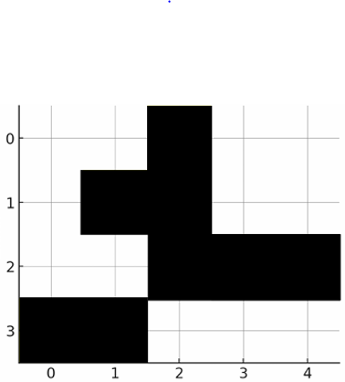

# Flood Fill algorithm

This repo presents a Python implementation of the Flood Fill algorithm to automatically identify and color all connected regions in a 2D grid, using different colors for each area. The project simulates an intelligent mapping system for autonomous robots exploring unknown terrain.

[1. What is the problem?](#what-is-the-problem)

[2. Understanding the algorithm](#understanding-the-algorithm)

[3. How to run the project in Python 🐍](#how-to-run-the-project-in-python)

[4. Extra Features 🚀](#extra-features)

[5. Algorithm analysis](#algorithm-analysis)

---

## What is the problem?
The core problem is finding all cells that are connected to a starting cell and meet a specific condition in a 2D grid representation of terrain with obstacles.



## Understanding the algorithm
To understand the algorithm, we did some studying and compiled my research in the [study](docs/study.md) file.

After studying the algorithm a little, we implemented the algorithm in Python. We also **added comments to the code** to make it easier to understand each step of the algorithm.

---

## How to run the project in Python 🐍
The Flood Fill algorithm, implemented in Python, can be found in the [main.py](code/main.py) file. You can download it if you want to run it on your computer.

This guide assumes you already have Python installed on your computer, ok? ✅

### Step 1: Install required dependencies 📦
The project uses `matplotlib` for graphical visualization. Install it using pip:

```bash
pip install matplotlib
```

### Step 2: Open your terminal 🖥️
First, you need to open a command-line interface.

### Step 3: Navigate to the correct folder 📂
You must tell the terminal where your `main.py` file is located. You'll use the `cd` (change directory) command for this. Navigate to the `code` folder containing the `main.py` file:

```bash
cd code
```

### Step 4: Run the file ▶️
Once you are in the correct folder, you can run the Python script:

```bash
python main.py
```

## Extra Features 🚀

### Interactive Menu System
The program offers multiple operation modes:
- **Option 1**: Use predefined example from the problem statement
- **Option 2**: Generate random grid with custom parameters
- **Option 3**: Manual input for complete control
- **Option 4**: Quick test with auto-generated 8×12 grid

### Random Grid Generation
- Customizable grid dimensions (rows × columns)
- Adjustable obstacle density (10% to 90%)
- Automatic valid starting position selection
- Perfect for testing algorithm robustness

### Dynamic Visualization
- Real-time animated filling process
- Step-by-step region coloring
- Side-by-side comparison (initial vs final grid)
- Smooth animations showing the Flood Fill progression
- Color-coded regions with legend

### Usage Example with Random Grid
```bash
python extra.py

# Choose option 2 for random grid
# Enter: 8 (rows), 12 (columns), 0.25 (obstacle probability)
# Watch the animated filling process!
```

### Input Format for Manual Mode
```
n m
val1 val2 ... val_m
val1 val2 ... val_m
...
x y
```

**Example:**
```
4 5
0 0 1 0 0
0 1 1 0 0
0 0 1 1 1
1 1 0 0 0
0 0
```

### Output Features
- **Terminal display**: Number matrix showing colored regions
- **Graphical visualization**: Color-coded grid with Matplotlib
- **Statistics**: Region count, navigable cells, obstacles detected
- **Color legend**: Clear mapping of number values to colors

### Example Output
```
Grid preenchido:
2 2 1 3 3
2 1 1 3 3
2 2 1 1 1
1 1 4 4 4

--- Estatísticas ---
Regiões coloridas: 3
Células navegáveis: 11
Obstáculos: 9
```

The enhanced implementation provides both educational value through visualization and practical utility through flexible input options and comprehensive analysis of the terrain mapping process.